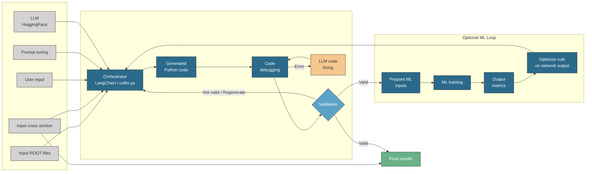

<div align="center">

# 🔬 texttt{CoLLM}: An automated, graphical user interface, end-to-end deep learning toolbox for collider analyse

### *LLM-Powered Physics Analysis Automation with deep learning*

[](https://www.python.org/downloads/)
[](https://opensource.org/licenses/MIT)
[](https://github.com/psf/black)
[](http://makeapullrequest.com)

<p align="center">
  
</p>

*Generate production-ready, single-file Python analysis scripts for Delphes ROOT outputs — no boilerplate, no headaches.*

[Getting Started](#-quickstart) •
[How It Works](#-how-the-workflow-works) •
[Configuration](#-prompts-and-contracts) •
[Troubleshooting](#-troubleshooting)

</div>

---

## ✨ What is This?

This project automates the creation of **executable Python analysis scripts** for **Delphes ROOT** outputs (`TTree "Delphes"`). Simply describe your physics cuts, validation plots, and desired output structure — and let the LLM do the heavy lifting.

> 💡 **The magic:** Your analysis specification goes in → validated, runnable Python code comes out.

### 🎯 Core Philosophy

| Step | What Happens |
|------|-------------|
| **1. Describe** | Define physics cuts, plots, and cutflow in `user_input.txt` |
| **2. Generate** | `collm.py` orchestrates LLM code generation |
| **3. Validate** | Strict checks catch syntax errors, missing patterns, unresolved placeholders |
| **4. Execute** | Run the validated script on your Delphes ROOT files |

---

## 📁 Repository Structure

```
.
├── 🎛️  collm.py              # Orchestrator: prompt loading, LLM inference, validation, output
├── 🛡️  validators.py         # Static validation gate with AST + pattern checks
├── 📐 schemas.py             # Pydantic schemas for structured user input
├── 📜 system_prompt.txt      # Hard constraints: vectorization rules, required code patterns
├── 💬 human_prompt.txt       # Template injecting user specifications into LLM request
├── ✏️  user_input.txt         # YOUR analysis specification (edit this!)
└── 🎯 generated_analysis.py  # Output: the generated analysis script
```

---

## 🚀 Quickstart

### Step 1: Define Your Analysis

Edit `user_input.txt` with three required sections:

```yaml
# SELECTION_CUTS
# Define your physics/object/event selections here

# PLOTS_FOR_VALIDATION  
# Specify which histograms to generate and save

# OUTPUT_STRUCTURE
# Describe how cutflow and final counts should be printed
```

### Step 2: Generate the Script

```bash
ipython collm.py -- --use_generate --quant 4bit --max_new_token 4096
```

### Step 3: Run Your Analysis

```bash
python generated_analysis.py path/to/input.root
```

Your script will:
- ✅ Open the ROOT file  
- ✅ Load branches via `tree.arrays(..., library="ak")`  
- ✅ Apply cuts in order (object → multiplicity → event)  
- ✅ Save plots with `plt.savefig(..., dpi=150)`  
- ✅ Print a cutflow summary with final counts  

---

## 📦 Requirements

<details>
<summary><b>🔧 Generator Dependencies</b> (this repo)</summary>

```
transformers
torch
langchain (+ HuggingFace integration)
pydantic
tqdm
matplotlib
bitsandbytes  # optional, for 4-bit quantization (NF4)
```

</details>

<details>
<summary><b>📊 Generated Script Dependencies</b> (constrained by system prompt)</summary>

```
uproot
awkward
vector
numpy
matplotlib
```

Plus standard library: `sys`, `json`, `pathlib`, `typing`

> ⚠️ Generated scripts are constrained to this stack and must call `vector.register_awkward()` immediately.

</details>

---

## ⚙️ How the Workflow Works



### 1️⃣ Inputs
- ROOT files + cross-section info  
- Your analysis specification (`user_input.txt`)  
- Optional prompt tuning

### 2️⃣ Orchestration (`collm.py`)
Builds prompt messages and supports two inference modes:

| Mode | Flag | Best For |
|------|------|----------|
| Direct `generate()` | `--use_generate` | Instruct models (uses `apply_chat_template`) |
| LangChain pipeline | *(default)* | Standard HuggingFace pipelines |

### 3️⃣ Validation Gate (`validators.py`)

Strict checks to prevent "runs but wrong physics" scenarios:

| Check | Purpose |
|-------|---------|
| AST Parse | Catches syntax errors |
| Placeholder Detection | Rejects `{branch}`, `{candidate}` artifacts |
| Required Patterns | Ensures `vector.register_awkward()` exists |
| Plot Enforcement | Verifies at least one `plt.savefig(...)` call |

### 4️⃣ Repair Loop
When validation fails, errors are fed back into the prompt for automatic retry.

### 5️⃣ Output
A concrete, validated `generated_analysis.py` ready for production use.

---

## 📜 Prompts and Contracts

| File | Purpose |
|------|---------|
| `system_prompt.txt` | **Hard constraints** — required imports, `vector.register_awkward()`, no event loops, plotting rules, branch-name robustness |
| `human_prompt.txt` | **Structured injection** — passes your three sections into the LLM |
| `user_input.txt` | **Your specification** — modify this to define different analyses |

---


## 🗺️ Roadmap

The architecture is designed for extensibility:

- [x] Analysis generation + validation pipeline
- [ ] ML loop integration (shown in workflow diagram)
- [ ] Multi-file output support
- [ ] Interactive prompt builder

---

<div align="center">

## 🤝 Contributing

Contributions are welcome! Please feel free to submit a Pull Request.


</div>
