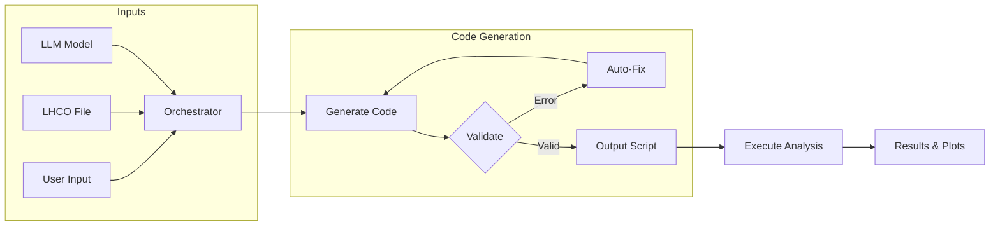

<div align="center">

# CoLLM

### An automated, graphical user interface, end-to-end deep learning toolbox for collider analyse


[](https://www.python.org/downloads/)
[](https://opensource.org/licenses/MIT)
[](https://github.com/psf/black)
[](http://makeapullrequest.com)

<p align="center">
  
</p>

*Generate production-ready Python analysis scripts for LHCO particle physics data using Large Language Models — no boilerplate, no headaches.*

</div>

---

## 📑 Table of Contents

- [ What is CoLLM?](#-what-is-collm)
  - [ Key Features](#-key-features)
- [ Installation](#-installation)
  - [Step 1: Clone the Repository](#step-1-clone-the-repository)
  - [Step 2: Create a Conda Environment](#step-2-create-a-conda-environment)
  - [Step 3: Install Dependencies](#step-3-install-dependencies)
- [ Quick Start](#-quick-start)
  - [Option 1: Terminal UI (TUI)](#option-1-terminal-ui-tui)
  - [Option 2: Graphical UI (GUI)](#option-2-graphical-ui-gui)
- [ Project Structure](#-project-structure)
- [ Configuration](#️-configuration)
  - [User Input File Format](#user-input-file-format)
  - [Example Configuration](#example-configuration)
  - [Supported LLM Models](#supported-llm-models)
- [ Usage](#-usage)
  - [Using the HuggingFace API](#using-the-huggingface-api)
  - [Programmatic Usage](#programmatic-usage)
  - [Running Generated Scripts](#running-generated-scripts)
- [ How It Works](#-how-it-works)
- [ LHCO File Format Reference](#-lhco-file-format-reference)
- [ Roadmap](#️-roadmap)
- [ License](#-license)

---

## 🔬 What is CoLLM?

**CoLLM** (Collider LLM) is an intelligent code generation tool that automates the creation of executable Python analysis scripts for **LHCO (Les Houches Collider Olympics)** files produced by fast detector simulations like Delphes. Simply describe your physics analysis in natural language, and CoLLM generates validated, runnable code.

### ✨ Key Features

- **🤖 LLM-Powered Code Generation** — Leverages state-of-the-art code models (Qwen, DeepSeek) to generate physics analysis code
- **🔄 Automatic Error Correction** — Self-healing code with automatic bug detection and fixing
- **🖥️ Dual Interface** — Choose between Terminal UI (TUI) or Streamlit-based Graphical UI (GUI)
- **⚡ GPU Acceleration** — Full support for CUDA (NVIDIA) and MPS (Apple Silicon)
- **📊 Built-in Validation** — Syntax checking and pattern validation before execution
- **🔌 API Support** — Use local models or HuggingFace Inference API

---

## 📦 Installation

### Step 1: Clone the Repository

```bash
git clone [https://github.com/yourusername/CoLLM.git](https://github.com/AHamamd150/CoLLM.git)
cd CoLLM
```

### Step 2: Create a Conda Environment

```bash
# Create a new conda environment with Python 3.11
conda create -n collm python=3.11 -y

# Activate the environment
conda activate collm
```

### Step 3: Install Dependencies

CoLLM automatically check and installs required dependencies on first run via the pip command. You don't have to install any package by yourself. 

> **Note:** CoLLM may requires NumPy < 2.0 for compatibility. The package manager will handle this automatically.

---

## 🚀 Quick Start

### Option 1: Terminal UI (TUI)

1. **Edit the configuration file** `user_input_TUI.yml`:

```yaml
Output_dir: "./output/"
DEFAULT_MODEL: "Qwen/Qwen2.5-Coder-14B-Instruct"
MAX_RETRIES: 3
Input_file: "./data/signal.lhco"
User_input: "./templates/user_input.txt"
Use_api: False
Api_key: "your_huggingface_api_key"  # Only needed if Use_api is True
```

2. **Define your analysis** in `templates/user_input.txt`:

```
[SELECTION_CUTS]
- Select electrons with pT > 10 GeV and |eta| < 2.5
- Select muons with pT > 10 GeV and |eta| < 2.4
- Require at least two leptons
- Require at least two jets

[PLOTS_FOR_VALIDATION]
- Plot the missing energy distribution
- Plot the invariant mass of leading and subleading leptons
- Normalize all histograms to one

[OUTPUT_STRUCTURE]
- Sve the produced histograms into png with dpi=150
- print summary statistics and print the number of events before and after the selection cuts
- save the following  in a single  csv file for MLP analysis:
  1- pt of the leading letpton
  2- pt of the leading tau leptons
  3- delta R between the leading lepton and leading tau
  4- delta eta between the leading and subleading b jets
```

3. **Run the analysis**:

```bash
chmod +x run.sh
./run.sh --run_TUI --input user_input_TUI.yml
```

### Option 2: Graphical UI (GUI)

Launch the Streamlit-based web interface:

```bash
./run.sh --run_GUI
```

This opens a browser window with an interactive interface to:
- Configure analysis parameters
- Define selection cuts and plots
- Monitor code generation in real-time
- View and download generated scripts

---

## 📁 Project Structure

```
CoLLM/
├── 📄 run.sh                    # Main entry point script
├── 📄 user_input_TUI.yml        # TUI configuration file
│
├── 📂 source/                   # Core source code
│   ├── 📂 LLM/                  # LLM code generation modules
│   │   ├── collm_lhco.py        # Main code generator
│   │   └── pyfixer.py           # Automatic code fixer
│   │
│   ├── 📂 GUI/                  # Streamlit GUI application
│   │   └── main.py              # GUI entry point
│   │
│   ├── 📂 runs/                 # Execution scripts
│   │   ├── run_preselection.py      # TUI runner
│   │   └── run_preselection_GUI.py  # GUI runner
│   │
│   ├── 📂 configs/              # System prompts and configs
│   │   └── system_prompt.txt    # LLM system instructions
│   │
│   └── 📂 utils/                # Utility modules
│       ├── requirements_check.py    # Dependency manager
│       └── read_configs.py          # Configuration parser
│
├── 📂 templates/                # User input templates
│   ├── user_input.txt           # Example analysis specification
│   ├── user_input_1.txt         # Additional example
│   └── user_input_2.txt         # Additional example
│
├── 📂 data/                     # Sample LHCO data files
│   ├── signal.lhco              # Example signal events
│   └── signal_1.lhco            # Additional example
│
└── 📂 logo/                     # Project assets
    ├── logo.png                 # CoLLM logo
    └── workflow.jpg             # Workflow diagram
```

---

## ⚙️ Configuration

### User Input File Format

The analysis specification uses three sections:

| Section | Purpose |
|---------|---------|
| `[SELECTION_CUTS]` | Define physics cuts (pT, eta, multiplicities, etc.) |
| `[PLOTS_FOR_VALIDATION]` | Specify histograms and visualization options |
| `[OUTPUT_STRUCTURE]` | Configure cutflow output and summary format |

### Example Configuration

```yaml
[SELECTION_CUTS]
- Select electrons with pT > 25 GeV and |eta| < 2.5
- Select muons with pT > 20 GeV and |eta| < 2.4
- Require exactly 2 opposite-sign leptons
- Require at least 2 jets with pT > 30 GeV
- Require MET > 40 GeV
- Select invariant mass of the dilepton pair between 76 and 106 GeV (Z window)

[PLOTS_FOR_VALIDATION]
- Plot dilepton invariant mass with 50 bins from 60 to 120 GeV
- Plot MET distribution
- Plot leading jet pT
- Normalize all histograms

[OUTPUT_STRUCTURE]
- Print cutflow table with event counts after each cut
- Sve the produced histograms into png with dpi=150
- save the following  in a single  csv file for MLP analysis:
  1- pt of the leading letpton
  2- pt of the leading tau leptons
  3- delta R between the leading lepton and leading tau
  4- delta eta between the leading and subleading b jets
```

### Supported LLM Models

| Model | Size | VRAM | Quality |
|-------|------|------|---------|
| `Qwen/Qwen2.5-Coder-32B-Instruct` | 32B | ~48GB | ⭐⭐⭐⭐⭐ |
| `deepseek-ai/DeepSeek-Coder-V2-Instruct` | 236B | ~40GB | ⭐⭐⭐⭐⭐ |
| `Qwen/Qwen2.5-Coder-14B-Instruct` | 14B | ~20GB | ⭐⭐⭐⭐ |
| `deepseek-ai/deepseek-coder-6.7b-instruct` | 6.7B | ~10GB | ⭐⭐⭐⭐ |
| `Qwen/Qwen2.5-Coder-7B-Instruct` | 7B | ~10GB | ⭐⭐⭐ |

---

## 🔧 Usage

### Using the HuggingFace API

For users without a local GPU, CoLLM supports the HuggingFace Inference API:

1. Get your API key from [HuggingFace](https://huggingface.co/settings/tokens)
2. Update `user_input_TUI.yml`:

```yaml
Use_api: True
Api_key: "hf_your_api_key_here"
```

### Programmatic Usage

```python
from source.LLM.collm_lhco import generate_lhco_code

# Using local model
code = generate_lhco_code(
    user_input_path="templates/user_input.txt",
    output_path="generated_analysis.py",
    model_id="Qwen/Qwen2.5-Coder-14B-Instruct"
)

# Using HuggingFace API
code = generate_lhco_code(
    user_input_path="templates/user_input.txt",
    output_path="generated_analysis.py",
    model_id="Qwen/Qwen2.5-Coder-14B-Instruct",
    use_api=True,
    api_key="your_hf_api_key"
)
```

### Running Generated Scripts

After code generation, execute the analysis:

```bash
python generated_analysis.py path/to/your/data.lhco
```

---

## 🔄 How It Works



1. **Input Processing** — Parse user specifications and load LHCO data
2. **Code Generation** — LLM generates Python analysis script
3. **Validation** — Check syntax and required patterns
4. **Auto-Repair** — Fix errors automatically if validation fails
5. **Execution** — Run validated script on physics data
6. **Results** — Generate plots and cutflow tables

---

## 📚 LHCO File Format Reference

| Column | Field | Description |
|--------|-------|-------------|
| 1 | `index` | Object index (0 = event header) |
| 2 | `type` | Particle type code |
| 3 | `eta` | Pseudorapidity |
| 4 | `phi` | Azimuthal angle (radians) |
| 5 | `pt` | Transverse momentum (GeV) |
| 6 | `jmass` | Jet mass (GeV) |
| 7 | `ntrk` | Track count (sign = charge) |
| 8 | `btag` | B-tag flag (1.0 = b-tagged) |
| 9 | `had/em` | Hadronic/EM energy ratio |

**Particle Type Codes:**
- `0` = Photon
- `1` = Electron
- `2` = Muon
- `3` = Tau
- `4` = Jet
- `6` = MET

---

## 🗺️ Roadmap

- [x] LHCO analysis generation with validation
- [x] Automatic code fixing and regeneration
- [x] Streamlit GUI interface
- [x] HuggingFace API support
- [ ] ML training loop integration
- [ ] Multi-file batch processing
- [ ] Interactive prompt builder

---

## 📄 License

This project is licensed under the MIT License - see the [LICENSE](LICENSE) file for details.
