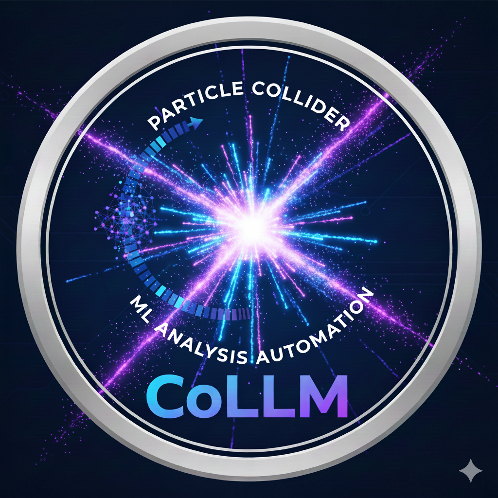
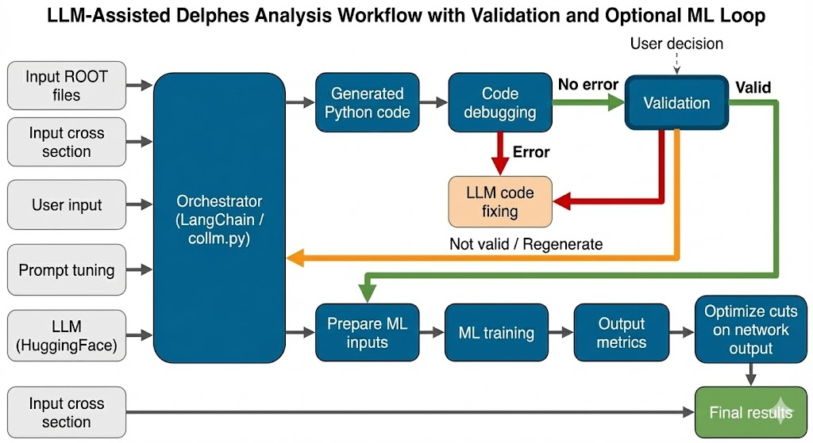

<div align="center">

# CoLLM

### Collider LLM — End-to-End Deep Learning Toolbox for HEP Analysis



[](https://www.python.org/downloads/)
[](https://opensource.org/licenses/MIT)
[](http://makeapullrequest.com)

*LLM-powered analysis code generation for LHCO data with integrated deep learning pipelines*

</div>

---

## Overview

CoLLM automates collider physics analysis by using Large Language Models to generate executable Python scripts from natural language descriptions.

<p align="center">
  
</p>

---
##  Installation

#### Step 1: Clone the Repository

```bash
git clone  https://github.com/AHamamd150/CoLLM.git
cd CoLLM
```

#### Step 2: Create a Conda Environment

```bash
# Create a new conda environment with Python 3.11
conda create -n collm python=3.11 

# Activate the environment
conda activate collm

# Activate the run file
cd CoLLM-main
chmod +x run.sh
```

#### Step 3: Install Dependencies

CoLLM automatically check and installs required dependencies on first run via the pip command. You don't have to install any package by yourself. 

> **Note:** CoLLM may requires NumPy < 2.0 for compatibility. The package manager will handle this automatically.

---

## Usage

#### Command Line Options

```bash
./run.sh [MODE] [OPTIONS]
```

| Mode | Description | Input Required |
|------|-------------|----------------|
| `--run_TUI` | Terminal-based code generation | Yes |
| `--run_GUI` | Streamlit web interface | No |
| `--run_MLP` | Train MLP classifier | Yes |
| `--run_GNN` | Train GNN classifier | Yes |
| `--run_Transformer` | Train Transformer classifier | Yes |

| Option | Description |
|--------|-------------|
| `--input <file>` | Path to configuration file |
| `--help` | Display help message |

---

### Mode 1: TUI (Terminal User Interface)

Generate analysis code from natural language via command line.

```bash
./run.sh --run_TUI --input templates/user_input_TUI.yml
```

#### TUI Configuration (`user_input_TUI.yml`)

```yaml
Output_dir: "./output/"
DEFAULT_MODEL: "Qwen/Qwen2.5-Coder-14B-Instruct" #meta-llama/Llama-3.3-70B-Instruct LLM is recommended but it needs an API
MAX_RETRIES: 3
Input_file: "./data/signal.lhco"
User_input: "./templates/user_input.txt"
Use_api: True
Api_key: "your_huggingface_api_key"
```

| Parameter | Description |
|-----------|-------------|
| `Output_dir` | Directory for generated scripts and plots |
| `DEFAULT_MODEL` | HuggingFace model ID |
| `MAX_RETRIES` | Retry attempts on validation failure |
| `Input_file` | LHCO data file to analyze |
| `User_input` | Natural language analysis description |
| `Use_api` | `True` for HF Inference API, `False` for local |
| `Api_key` | HuggingFace API token (required if `Use_api: True`) |

#### User Input Format (`user_input.txt`)

```
[SELECTION_CUTS]
- Select electrons with pT > 25 GeV and |eta| < 2.5
- Select muons with pT > 10 GeV and |eta| < 2.4
- Require at least 2 jets with pT > 30 GeV
- MET > 50 GeV

[PLOTS_FOR_VALIDATION]
- Plot leading electron pT (50 bins)
- Plot MET distribution
- Plot invariant mass of leading leptons (range 10-200 GeV)
- Normalize all histograms to unity

[OUTPUT_STRUCTURE]
- Save the histograms in png format
- Print cutflow with event counts
```

---

### Mode 2: GUI (Graphical User Interface)

Launch the Streamlit web interface for interactive configuration.

```bash
./run.sh --run_GUI
```

Opens browser at `http://localhost:8501` with:
- Interactive cut builder
- Real-time code preview
- Integrated plot viewer

---

### Mode 3: MLP Training

Train a Multi-Layer Perceptron classifier on tabular data.

```bash
./run.sh --run_MLP --input config.yaml
```

---

### Mode 4: GNN Training

Train Graph Neural Network classifiers (GCN, GAT, EdgeConv).

```bash
./run.sh --run_GNN --input gnn_config.yaml
```

#### GNN Configuration Example

```yaml
model:
  type: GAT                    # GCN, GAT, or EdgeConv
  layers:
    - out_channels: 64
      heads: 4
      activation: relu
      batchnorm: true
      dropout: 0.1
    - out_channels: 64
      heads: 4
      activation: relu
  pooling: mean                # mean, max, add
  output_units: 2

train:
  epochs: 100
  batch_size: 32
  learning_rate: 0.001
  device: auto                 # auto, cpu, cuda
```

### Mode 5: Transformer Training

Train Transformer classifier on particle cloud dataset.

```bash
./run.sh --run_Transformer --input transformer_config.yaml
```

#### Transformer Configuration Example

```yaml
model:
  embed_dim: 128                # embedding dimension
  num_heads: 8                 # number of attention heads
  num_layers: 4                # number of transformer layers
  ffn_dim: 256                  # feed-forward network dimension
  dropout: 0.1                 # dropout rate
  attention_dropout: 0.1       # attention dropout rate
  pooling: mean                  # pooling method: mean, max, attention
  num_classes: 2                # number of output classes
  pre_norm: true               # use pre-normalization

train:
  epochs: 100
  batch_size: 32
  learning_rate: 0.001
  device: auto                 # auto, cpu, cuda
```

---

## Project Structure

```
CoLLM/
├── run.sh                     # Main entry point
├── user_input_TUI.yml         # TUI configuration
├── config.yaml                # MLP configuration
├── data/                      # Sample LHCO files
├── output/                    # Generated outputs
├── templates/                 # User input examples
└── source/
    ├── LLM/
    │   ├── collm_lhco.py      # LLM orchestrator
    │   └── pyfixer.py         # Code validation
    ├── DL/
    │   ├── MLP/               # MLP classifier
    │   ├── GNN/               # GNN models (GCN/GAT/EdgeConv)
    │   └── Transformer/       # Transformer models
    ├── GUI/
    │   └── main.py            # Streamlit app
    ├── configs/               # System prompts
    ├── runs/                  # Run scripts
    └── utils/                 # Utilities
```

---


## Supported LLM Models

| Model | Notes |
|-------|-------|
| `Qwen/Qwen2.5-Coder-14B-Instruct` | Local/API  |
| `meta-llama/Llama-3.3-70B-Instruct` | API only (Recommended) |
| `codellama/CodeLlama-34b-Instruct-hf` | Local/API |

Local inference supports:
- 4-bit quantization (CUDA with bitsandbytes)
- MPS acceleration (Apple Silicon)
- CPU fallback

---

## Examples

```bash
# Generate analysis code via TUI
./run.sh --run_TUI --input user_input_TUI.yml

# Launch web interface
./run.sh --run_GUI

# Train MLP on signal/background data
./run.sh --run_MLP --input templates/mlp_config.yaml

# Train GNN classifier
./run.sh --run_GNN --input templates/config_example_gcn.yaml

# Train Transformer classifier
./run.sh --run_Transformer --input templates/config_transformer.yaml

# Show help
./run.sh --help
```


